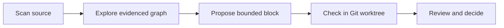

# Block Beaver

<p align="center"></p>

<p align="center">
  <a href="https://github.com/sirnax/block-beaver/releases"></a>
  <a href="https://github.com/sirnax/block-beaver/actions/workflows/ci.yml"></a>
  <a href="https://github.com/sirnax/block-beaver/actions/workflows/secret-scan.yml"></a>
  <a href="https://github.com/sirnax/block-beaver/actions/workflows/codeql.yml"></a>
  <a href="LICENSE"></a>
  <a href="#supported-environments"></a>
  <a href="#supported-environments"></a>
  <a href="https://github.com/sirnax/block-beaver/issues"></a>
</p>

Block Beaver makes the shape of a codebase visible. Scan a JavaScript, TypeScript, or React repository, follow each observed relationship to its source line, and turn a candidate feature into a reviewed block proposal. It runs locally and keeps code changes inside bounded Git worktrees.

**[Project page](https://sirnax.github.io/block-beaver/)** · **[Get started](#quick-start)** · **[How it works](#how-it-works)** · **[CLI and workflow](#propose-a-block)** · **[Plan](Block-Studio-PLAN.md)** · **[Contribute](CONTRIBUTING.md)**

> **v0.1.0 is an early release.** The graph is an aid to review, not a complete static analysis. Block Beaver is [Apache-2.0 licensed](LICENSE). The npm package is marked private, so install it from source.

## Supported environments

The CLI and local browser console run with **Node.js 22, 24, or 26**. CI checks Linux on all three versions and macOS and Windows on Node.js 24. The scanner reads JavaScript, JSX, TypeScript, and TSX, including MJS, CJS, MTS, and CTS files. Git is needed for roadmap checks and worktrees. This release is distributed as source through GitHub; it is not published to npm.

## Why use it?

| See the code | Draw a boundary | Keep the record |
| --- | --- | --- |
| Files, functions, components, hooks, and their evidenced connections appear in one graph. | Propose a cohesive feature with a declared file scope, dependencies, and verification commands. | Checks run in an isolated worktree; reviews, decisions, and failures stay in an ordered roadmap ledger. |

The visual console explores and previews. The CLI and optional authenticated worker handle roadmap operations. TeaCake is a read-only reference and optional adapter; no TeaCake files are required for another project.

## Quick start

Requires **Node.js 22+**. Install dependencies, then launch the local console:

```sh
npm ci
npm start
```

Open **http://127.0.0.1:4173**, enter an absolute path to a project, and select **Scan project**. The console binds to localhost and offers read and preview operations. Set `BLOCK_BEAVER_REPO=/path/to/project` to prefill the path.

For a terminal first look:

```sh
node bin/block-beaver.mjs scan --root /path/to/project
```

## How it works



Scanning does not change the target repository. Creating a roadmap opts that repository into `.blocks/` records. A proposal cannot advance after failed checks or source drift. [Read the original plan](Block-Studio-PLAN.md), written under the working title “Block Studio,” for the intended stages and boundaries.

## Explore from the CLI

```sh
node bin/block-beaver.mjs scan --root /path/to/project
node bin/block-beaver.mjs search Button --root /path/to/project
node bin/block-beaver.mjs inspect 'symbol:src/Button.tsx#Button' --root /path/to/project
# Optional TeaCake adapter: delegate a read-only query to its own dev kit
node bin/block-beaver.mjs kit list_blocks --root /path/to/teacake
```

`scan --full true` prints the complete normalized graph. The graph has `schemaVersion`, a source fingerprint, nodes (`file`, `function`, `component`, `hook`, `class`, and optional `block`), and typed edges. Every edge includes `evidence.file`, `line`, `column`, and source text. The scanner reads JS, JSX, TS, TSX, MJS, CJS, MTS, and CTS; it ignores build output, dependencies, Git metadata, and `.blocks/`.

The scanner host accepts language plugins with `accepts`, `parse`, `declarations`, `evidence`, and `links` methods. The included [JS/TS/React plugin](src/plugins/js-ts-react.mjs) uses the TypeScript parser. A later language can emit the same graph contract without changing the console or workflow.

## Propose a block

A target repository opts in when you create a roadmap. The scope is an explicit list of scanned source files. Block Beaver writes its roadmap, proposals, checks and ordered event log to that repository's `.blocks/roadmaps/` directory. It never writes to TeaCake during the scans described above.

```sh
node bin/block-beaver.mjs plan account-card --root /path/to/project --scope src/account/Card.tsx,src/account/data.ts
node bin/block-beaver.mjs propose account-card /path/to/proposal.json --root /path/to/project
node bin/block-beaver.mjs check account-card account-card --root /path/to/project
node bin/block-beaver.mjs review account-card account-card --root /path/to/project
node bin/block-beaver.mjs approve account-card account-card --root /path/to/project
# After a failed check, repair within the same file boundary, then check again:
node bin/block-beaver.mjs repair account-card account-card /path/to/revised-proposal.json --root /path/to/project
node bin/block-beaver.mjs resume account-card --root /path/to/project
```

A proposal JSON may contain the fields below. `patches` are optional, complete replacement file contents. Each patch's `baseHash` must match the hash from `scan --full true` for that source path.

```json
{
  "id": "account-card",
  "name": "Account card",
  "description": "Shows an account summary.",
  "rationale": "The card and its data loader make one cohesive feature.",
  "files": ["src/account/Card.tsx", "src/account/data.ts"],
  "dependencies": [],
  "verification": ["npm test"],
  "patches": [
    {
      "path": "src/account/Card.tsx",
      "baseHash": "from-scan-output",
      "content": "replacement source text"
    }
  ]
}
```

`propose` validates the boundary and stores the proposal. `check` verifies the contract, source fingerprint, patch hashes, and patch syntax, then creates an isolated Git branch and worktree under `.blocks/worktrees/`. It applies the proposed files there and runs the manifest's verification commands. `review` shows the proposed manifest and before/after content. `approve` records the decision only after the latest checks passed and the worktree still matches them. The original checkout stays untouched. `reject ... --reason TEXT` records a rejection. `resume` rebuilds slice status from `events.jsonl`. A failed check or changed source cannot be approved.

`repair` replaces a pending or failed proposal but requires the same slice ID, implementation files, and patch paths. It records a new event and resets the slice to proposed. A repair cannot silently widen its scope.

The console can preview a candidate block from a folder and download its JSON proposal. For local declared blocks, it can also preview a new dependency connection with before/after manifests and download that as a proposal. It plays the recorded roadmap ledger and shows the files involved in each event. Browser actions never apply patches.

## Agent and worker interfaces

An agent adapter is any local executable that accepts one JSON request on stdin and returns one JSON response on stdout. Run it with `node bin/block-beaver.mjs agent --exec /path/to/adapter --scope src/one.ts,src/two.ts --root /path/to/project`. The request includes protocol version 1, the bounded source contents and hashes, graph nodes and edges for that scope, and the scan fingerprint. The response contains `{"protocol":1,"proposals":[...]}`. Block Beaver validates each proposed boundary and patch path before returning it; `agent` does not save or apply anything. A proposal is passed through the ordinary `propose`, `check`, `review`, and `approve` operations.

For a separate code-changing process, start the authenticated worker with an explicit repository path and a strong token:

```sh
BLOCK_BEAVER_REPO=/path/to/project BLOCK_BEAVER_TOKEN=replace-with-a-random-secret npm run worker
```

It binds to `127.0.0.1:4174` and requires `Authorization: Bearer <token>` on every request. POST JSON to `/scan`, `/inspect`, `/search`, `/suggest`, `/plan`, `/propose`, `/repair`, `/check`, `/review`, `/approve`, `/reject`, or `/resume`. The worker rescans before source-dependent operations. The visual server on port 4173 has no mutation endpoints and never receives the worker token. Both servers are intended for trusted local use; do not expose either port through a proxy or tunnel. Scan only repositories you are authorized to read, and review verification commands before running them because they execute in a worktree.

## Contracts and boundaries

- `.blocks/manifests/*.json` in a target repository are feature contracts. They describe a cohesive boundary, implementation files, dependencies, rationale, and verification commands. Functions and components remain observed pieces, not forced into individual manifests.
- Existing TeaCake manifests remain authoritative. The adapter reads `docs/blocks/index.json` and its generated map, and adds those blocks to the graph with links to their implementation files. It delegates read-only `kit` queries to TeaCake's own dev kit, and a migration `check` in an isolated TeaCake worktree includes `pnpm blocks:check`. It does not generate a parallel TeaCake registry. TeaCake codegen remains an explicit step inside a proposed worktree; generated changes must be reviewed within that slice's scope.
- CLI JSON is the agent-neutral interface. An agent can generate a proposal file, but scope, validation, review and approval use the same commands as a person.
- `verification` commands run in the isolated worktree during `check`, without a shell. Use simple command-and-argument strings such as `npm test`; shell operators and substitutions are rejected. Review the branch and its test output before merging it.
- The scanner resolves local relative imports and the common `@/` → `src/` alias. Dynamic imports, runtime calls, arbitrary path aliases, and relationships hidden behind reexports may be absent. Edges are observations, not a claim that every runtime dependency has been found.

## Verify

```sh
npm run check
node bin/block-beaver.mjs scan --root /path/to/teacake
node bin/block-beaver.mjs scan --root /path/to/another/js-app
```

The focused tests cover source evidence, React rendering links, candidate boundaries, worktree approval, ledger replay, and source drift. The original implementation plan is in [Block-Studio-PLAN.md](Block-Studio-PLAN.md).

## Contribute and get help

Read [CONTRIBUTING.md](CONTRIBUTING.md) before opening a pull request. Use the issue templates for bugs and feature ideas. For a security issue, follow [SECURITY.md](SECURITY.md) and avoid public issues. [SUPPORT.md](SUPPORT.md) explains where to ask usage questions. Changes are recorded in [CHANGELOG.md](CHANGELOG.md).

The [project page](https://sirnax.github.io/block-beaver/) shows the visual concept and quick start. [Release notes](CHANGELOG.md) and the [release process](docs/RELEASING.md) describe each version.
