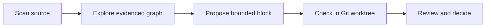

# Block Beaver

<p align="center"></p>

<p align="center">
  <a href="https://github.com/sirnax/block-beaver/releases"></a>
  <a href="https://github.com/sirnax/block-beaver/actions/workflows/ci.yml"></a>
  <a href="https://github.com/sirnax/block-beaver/actions/workflows/secret-scan.yml"></a>
  <a href="https://github.com/sirnax/block-beaver/actions/workflows/codeql.yml"></a>
  <a href="LICENSE"></a>
  <a href="#supported-environments"></a>
  <a href="#supported-environments"></a>
  <a href="https://github.com/sirnax/block-beaver/issues"></a>
</p>

Block Beaver makes the shape of a codebase visible. Scan a JavaScript, TypeScript, or React repository, follow each observed relationship to its source line, and turn a candidate feature into a reviewed block proposal. It runs locally and keeps code changes inside bounded Git worktrees.

**[Project page](https://sirnax.github.io/block-beaver/)** · **[Get started](#quick-start)** · **[How it works](#how-it-works)** · **[Working in blocks](docs/BLOCK_WORKFLOW.md)** · **[CLI and workflow](#propose-a-block)** · **[Plan](docs/tasks/block-studio.md)** · **[Contribute](CONTRIBUTING.md)**

> **This is an early release.** The graph is an aid to review, not a complete static analysis. Block Beaver is [Apache-2.0 licensed](LICENSE).

## Supported environments

The CLI and local browser console run with **Node.js 22.18+, 24, or 26**. Family contract loading uses Node's built-in TypeScript stripping and `module.registerHooks`, so it requires Node 22.18+ (or a compatible newer release). A repository can configure its own TypeScript loader package with `.blocks/config.json`'s `loader` field. CI checks Linux on Node 22.18.0, 22, 24, and 26 and macOS and Windows on Node 24. The scanner reads JavaScript, JSX, TypeScript, and TSX, including MJS, CJS, MTS, and CTS files. Git is needed for roadmap checks and worktrees. Install the published CLI with `npm install --save-dev --save-exact block-beaver@0.7.0`. Source contributors can use `npm ci` and `npm link` from this checkout.

## Why use it?

| See the code | Draw a boundary | Keep the record |
| --- | --- | --- |
| Files, functions, components, hooks, and their evidenced connections appear in one graph. | Propose a cohesive feature with a declared file scope, dependencies, and verification commands. | Checks run in an isolated worktree; reviews, decisions, and failures stay in an ordered roadmap ledger. |

The visual console explores and previews. The CLI and optional authenticated worker handle roadmap operations. Optional typed families let a repository define its own manifest contracts and generated outputs. Block Beaver ships no domain families.

## Quick start

Requires **Node.js 22.18+**. From your project repository, inspect and install the managed integration:

```sh
npx block-beaver@0.7.0 install --agents claude,codex --dry-run
npx block-beaver@0.7.0 install --agents claude,codex
npx --no-install block-beaver start
```

`start` generates the project map and watches for changes. Open the generated HTML map to inspect your repository.

For the development repository’s interactive localhost console, clone Block Beaver and run from its source checkout:

```sh
npm ci
npm start
```

Open **http://127.0.0.1:4173**, enter an absolute path to a project, and select **Scan project**. The console binds to localhost and offers read and preview operations. Set `BLOCK_BEAVER_REPO=/path/to/project` to prefill the path.

For a terminal first look:

```sh
npx block-beaver@0.7.0 scan --root /path/to/project
```

## Use it with your AI editor

Install the command in the project you want to build:

```sh
npm install --save-dev --save-exact block-beaver@0.7.0
```

Then run one command for the project you want to build:

```sh
npx --no-install block-beaver start --root /path/to/your-project
```

Open the localhost URL it prints (port 4175 by default). This command installs project guidance for editors using `AGENTS.md`, Claude Code, Cursor, and GitHub Copilot; creates `.blocks/WORKFLOW.md`; generates `.blocks/view/index.html` and `graph.json`; and refreshes both the files and the open browser view as source and manifests change. Existing instructions outside the marked Block Beaver section are preserved. Repeating setup does not duplicate instructions. Keep the process running for live updates; Ctrl+C stops it. No hand-editing of instruction files or HTML is required.

The installed rules tell the AI editor to read the registry, work within a feature boundary, use proposals/checks/review, and regenerate the map after changes. These are project files that travel with the repository. Each machine still needs Block Beaver installed, and each editor must have its project instructions enabled. The rules guide the agent; Block Beaver's workflow commands enforce scope and approval. The live map shows the current checkout and does not itself approve or validate arbitrary edits.

For setup without a live session, use `block-beaver init --root /path/to/your-project`. For a one-time regeneration, use `block-beaver update --root /path/to/your-project`. The generated HTML also opens offline. To install only one editor's instructions, add `--editor agents`, `claude`, `cursor`, or `copilot` to `init` or `start`; the default is `all`. A source-only install can use `node /path/to/block-beaver/bin/block-beaver.mjs start --root /path/to/your-project`, but putting the command on PATH with `npm link` lets future editor sessions use the portable commands in the installed guide.

## Install, upgrade and audit

For a repository-local installation, run `npx block-beaver@0.7.0 install`. Installation pins Block Beaver as a development dependency (add `--runtime` to pin it exactly under `dependencies` instead, for apps whose production code imports `block-beaver/kernel` or `block-beaver/view` without bundling; `upgrade` keeps whichever placement exists, and `audit` warns with `runtime-import-dev-dependency` when runtime code imports it while it is only a devDependency), detects npm, pnpm, Yarn or Bun, and plans managed editor skills, native hooks, Git hooks, CI and generated views. Use `--agents claude,codex` to select editors and `--dry-run` to inspect planned changes first.

`block-beaver upgrade` preserves owner content and refuses edited managed sections; `--force` repairs the owned sections. `block-beaver uninstall` removes owned integration while preserving project data. Removing `.blocks/` requires `--remove-data --yes`. Ignore/exclusion adjustments are opt-in through `--fix-ignores` and `--fix-excludes`.

pnpm's `minimumReleaseAge` can block installing a just-published Block Beaver: when the new version is not excluded, the upgrade install fails while the lockfile still holds the old one. Add both the old and the new version to `minimumReleaseAgeExclude` (or `block-beaver` to it), or wait out the age, run the upgrade install, then remove the old version from the exclusion.

`block-beaver audit --staged` checks the staged snapshot; CI uses `audit --base merge-base --strict` after fetching its target branch and regenerating the view. In staged and range audits a gitignored, uncommitted view is regenerated inside the snapshot, so the pre-commit hook passes without a manual `update`; a committed view, and a working-tree `audit`, are still compared against the files on disk. `block-beaver baseline --lower [--dry-run]` records lower coverage and resolution counts in `.blocks/baseline.json` (for example after adding `ignore` entries) and never raises them; `upgrade` does the same. Stable rules include `config-valid`, `manifest-valid`, `family-valid`, `managed-current`, `view-fresh`, `undeclared-link`, `coverage-ratchet`, `resolution-ratchet`, `exception-valid`, `family-drift`, `lint-baseline-ratchet` and `reviewed-content`. Resolution is strict on request; coverage and opt-in lint allowances can only go down. `audit` prints JSON by default. `--format summary` prints one line when it passes (`block-beaver audit: pass (N files, 0 errors)`, plus the warning count if there are warnings). On failure it prints `block-beaver audit: fail (N files, E errors)`, then one line per error (`rule · path · field · message - fix: <remediation>`) and the distinct warnings (`warning · code · path · message`). Exit codes do not change. The managed pre-commit and lefthook hooks and the GitHub and GitLab CI jobs use `--format summary`; run `block-beaver audit` for the full report. Approved slices are applied and receipted with `block-beaver integrate ROADMAP BLOCK`. Native `hook-check` uses cached context and fails open on missing or invalid cache; audit and workflow commands enforce the recorded gates.

## How it works


```mermaid
flowchart LR
  A[Scan source] --> B[Explore evidenced graph]
  B --> C[Propose bounded block]
  C --> D[Check in Git worktree]
  D --> E[Review and decide]
```

The first scan writes detected apps to `.blocks/config.json`; it does not edit source. `init` and `start` install project instructions and generated views; creating a roadmap writes `.blocks/` workflow records. A proposal cannot advance after failed checks or source drift. [Read the original plan](docs/tasks/block-studio.md), written under the working title “Block Studio,” for the intended stages and boundaries.

## Explore from the CLI

```sh
node bin/block-beaver.mjs scan --root /path/to/project
node bin/block-beaver.mjs search Button --root /path/to/project
node bin/block-beaver.mjs inspect 'symbol:src/Button.tsx#Button' --root /path/to/project
node bin/block-beaver.mjs kit list --root /path/to/project
```

`scan --full true` prints the complete normalized graph. The graph has `schemaVersion`, a source fingerprint, nodes (`file`, `function`, `component`, `hook`, `class`, and optional `block`), and typed edges. Every edge includes `evidence.file`, `line`, `column`, and source text. The scanner reads JS, JSX, TS, TSX, MJS, CJS, MTS, and CTS; it ignores build output, dependencies, Git metadata, and `.blocks/`.

The scanner host accepts language plugins with `accepts`, `parse`, `declarations`, `evidence`, and `links` methods. The included [JS/TS/React plugin](src/plugins/js-ts-react.mjs) uses the TypeScript parser and resolver. A later language can emit the same graph contract without changing the console or workflow.

## Optional typed families

Projects that need typed block records can opt in by adding families to `.blocks/config.json`. With no `families` key, Block Beaver uses the base file-boundary workflow. Family order sets the order of the generated index and registries, and the map floor order unless `map.floors` gives a different one. IDs, fields, manifest locations, suffixes, and link kinds belong to the adopting project.

```json
{
  "schemaVersion": 1,
  "families": [
    {
      "id": "widget",
      "contract": "blocks/widget.family.ts",
      "manifests": "blocks/widgets/*.item.ts"
    }
  ]
}
```

A family contract exports a definition from `block-beaver/kernel`. Its schema describes that family's fields, while the kernel supplies `id`, `family`, `version`, `name`, `description`, `rationale`, and `implementation`:

```ts
import { defineFamily, s } from 'block-beaver/kernel';

export default defineFamily({
  id: 'widget',
  fields: s.object({ label: s.string() }),
  implementation: ['module', 'none'],
  links: [{ field: 'parent', to: 'widget', kind: 'contains' }],
  map: { title: 'Widgets', blurb: 'Project-defined widget records.' }
});
```

Each manifest module has one export and its ID must match the single `*` captured by the configured manifest glob. Use `implementation: { kind: 'module', module: './widget.js' }` for code-backed blocks or `{ kind: 'none' }` for data-only blocks. The `.blocks/index.json` generator writes the canonical JSON index; request it by setting `generators: ['index']` in the family contract. `registry` also requires `registry.out` in that family's config. Config-level `generators` can name custom generator modules.

A link can also match values instead of naming one target. `links: [{ field: 'tools', to: 'tool', match: 'modes[]', kind: 'can-use' }]` adds an edge to every manifest of the `to` family whose `match` values share a primitive value with the source `field` values. `match` is a `.`/`[]` path over the target family's fields and is checked against its contract (`link-path-invalid`); `to` must name exactly one family (`link-target-family`). Strings, numbers and booleans are compared by type; objects, arrays and null are ignored. No match means no edge and no diagnostic, and a block never joins itself. Join edges are ordinary link edges, so `dependencies`, `undeclared-link`, `unused` and the map treat them like any other. Their evidence reads like `$.tools ↔ tool.$.modes[] → tool:create-note`.

A contract can group its blocks on the map with `map: { group: { field, join?, empty?, format? } }`. Primitive values at the `field` path are joined with `join` (default `', '`). If there are none, the block uses `empty`, or stays ungrouped when `empty` is unset. `format` has exactly one `{value}` and also applies to the `empty` fallback. A family's `group` wins over config `map.groupBy`; a family with neither shows no grouping. Invalid settings fail `contract-invalid` at `$.map.group`, `.field`, `.join`, `.empty` or `.format`.

Custom generators receive a context with `ctx.manifests`, `ctx.blocks()` and `ctx.entries(family?)`. `entries` is read-only and returns `{ ref, family, id, path, exportName, hash, value }` in `ctx.manifests` order, for every family when called without an argument. A generator that needs each manifest's import path and export name can read them from there. A changed path or export name re-runs cached generators.

### Adopting an existing family system

A project that already has hand-built typed blocks (manifests, codegen and a map) can move its build-time engine onto families without changing manifest data. The following options exist for that move. Every one of them is optional, and leaving it out keeps 0.5.1 behaviour.

- **Extra implementation fields.** `implementationFields` in a contract adds fields to an implementation arm, for example `{ module: s.object({ export: s.optional(s.string()), loading: s.optional(s.enum(['eager', 'lazy'])) }) }`. Undeclared keys still fail, `module` is still required and must resolve, and `kind` and `module` cannot be redeclared.
- **Data-only kinds.** `dataKinds: ['plan']` declares extra data-only implementation kinds. They must also be listed in `implementation`; a data kind's own fields need the pair `dataKinds: ['plan']` plus `implementationFields: { plan: s.object({ plan: s.object({ steps: s.integer() }) }) }` (without it a `{ kind: 'plan', plan: {...} }` manifest fails with `$.implementation.plan` unknown-key, and the message names `implementationFields.plan`). Unlike `module`, they are accepted in runtime mode, and they never create an `implemented-by` boundary.
- **Set-wide checks.**
  - A contract's `checkAll(manifests, { families, get, all })` sees every valid manifest of its family. `all(familyId)` returns another family's manifests.
  - Config `checks: ['path/to/checks.ts']` names modules whose default export `(manifests, { families, get, all })` runs after every family loads, with `manifests` spanning every family.
  - Both return `{ message, block?, field?, code? }` issues. Within `checkAll` a `block` is a bare id; config modules use the full `family:id` ref.
  - Findings report under the `family-valid` rule with the manifest's file, in both `audit` and `gen --check`.
- **Excluding files from a family.** Per-family `exclude: [glob]` removes files from a family's manifests and from `family-unclaimed`. The config `ignore` list also applies to manifest discovery. A file under a `fixtures`, `__fixtures__`, `test` or `tests` folder that matches a family's suffix but no family claims is reported as a warning, not an error.
- **Floor order.** `map.floors: [familyId, …]` sets the map floor order, listed as drawn from the top. Families it leaves out follow in config order. The index, registries and `ctx.blocks()` keep the `families` order, so their bytes don't change when only `map.floors` changes.
- **Stable generation.** `gen` repeats plan, write and rescan until no output changes, up to three passes. This covers manifests or generators that import a generated output. If outputs still differ after the third pass, `gen` reports `generator-unstable` with the files involved. `gen --check` and `--dry-run` stay a single read-only plan.
- **Map parity.**
  - `graph.json` (still schema 2) adds `codeReach`: which ordinary folders import a block's implementation, or bind to it through a `map.bindings` registry call such as `{ "family": "node", "call": "withNode", "registry": "NODE_BY_ID" }`.
  - It also adds `unused`, the blocks that no other block links to and no ordinary code reaches.
  - Each history snapshot adds `gone`, the blocks that had been removed by that point.
  - The map draws all of these. `map.groupBy` clusters blocks within a floor by a manifest field. `map.skins: [{ "id", "path", "tokens" }]` offers several skins with a viewer toggle; `map.skin` and `map.tokens` still work. Skins can theme controls with the tokens `control-surface`, `control-border`, `control-text`, `control-hover` and `panel-surface`.
- **Map drawing.** The map is an exploded isometric tower: one tilted floor plate per family, one solid brick per block (top, two shaded sides and a stud), packed in a near-square grid with a pill tag showing the family title and count.
  - Dotted risers up the left side carry the number of links between floors, by kind. Ordinary code is a rail of grey bars, one row per folder, longest reach first.
  - Selecting a brick lights it and its links and dims the rest. `Fit`, `+` and `-` zoom the map, Ctrl or ⌘ with the scroll wheel zooms, dragging pans when zoomed in, and `Play` steps through the history.
  - Floors take colours from a built-in palette by floor order. The token `family-<id>` recolours one floor, for example `"tokens": { "family-tool": "#3d96d3" }`.
  - A skin can restyle `.top`, `.l`, `.r` and `.stud` (`.stud { display: none }` gives a flat brick). Per-state looks use the custom properties `--edge`, `--dash`, `--fo`, `--face` and `--top` on `.family-node`, because a brick's faces are shared `<use>` copies.

### Taking over existing outputs

`gen` will not overwrite a claimed output that has no Block Beaver header: it reports `output-conflict`, and the message names `gen --adopt`. `block-beaver gen --adopt PATH…` takes over the listed outputs; a bare `--adopt` takes over every conflicting claimed output. Adopted outputs report `status: "adopted"`, `bodyIdentical` (strict: true when only a recognised header line differs) and `bodyIdenticalIgnoringLeadingComment` (true when the bodies match after one leading comment block is stripped from each side, for an old file with its own multi-line generated header). Review with `gen --adopt --dry-run`. `gen --check` never adopts and rejects `--adopt` as a usage error. `gen` and `gen --check` print JSON by default; `--format summary` prints one line when clean (`block-beaver gen: N outputs current`, or `wrote N outputs`) and one line per failing output (`path · code · message`) otherwise, so a `gen --check` alias stays quiet on a passing commit. Exit codes do not change. A listed path that no generator claims fails `adopt-not-claimed`. Nothing is deleted, so a file that predates Block Beaver stays in place.

Claimed outputs are known from registry `out` values, the index and history paths, literal `out:` values in generator modules and outs recorded in the generator cache. Contracts and checks may import generated outputs. If one is deleted, loading fails before the generator could recreate it, and Block Beaver reports `output-required-for-load` naming the output and the importer. Run `git restore <out>`, then `gen --adopt <out>` if it predates Block Beaver. Do not delete outputs that contracts or checks import.

A generator can own part of a file instead of the whole file. `defineGenerator({ out: 'README.md', region: 'roadmap-badge', inputs, generate })` writes only between two marker lines in the file's comment style:

- Markdown and HTML: `<!-- block-beaver:region ID -->` and `<!-- /block-beaver:region ID -->`
- JS and TS: `// block-beaver:region ID` and `// /block-beaver:region ID`
- CSS: `/* block-beaver:region ID */` and `/* /block-beaver:region ID */`

Markers are whole lines. Region outputs have no header, the rest of the file is never touched and CRLF line endings are kept. Missing or duplicate markers fail `region-missing` or `region-duplicate` and nothing is written. `gen --check` compares only the region. Two generators may own different regions of one file; the same region twice, or a whole-file and a region output on one file, is `output-collision`. JSON outputs cannot have regions.

The history label can come from code. Set `history.label` to `{ "module": ".blocks/history-label.ts" }`. The module's default export `(ctx) => string | null` receives the generator context, and an optional `export const inputs` lists files whose changes re-evaluate the loader; the label itself is computed only when an entry is appended. It runs only when a history entry is appended, `--label` still overrides it, and a plain string label is unchanged. An invalid module fails `history-label-invalid` and nothing is written.

### Hosting the map

`block-beaver view --format module --out PATH` exports the map as a module for a host app. `--detail full` (the default) embeds the whole graph. `--detail map` embeds only what the family map draws: blocks, family links, code reach, unused blocks, app and folder slabs with counts, and history. It leaves out the file-level graph and source evidence text. On a 174-block, 1800-file synthetic graph this was about 4% of the full size (8.95 MB to 388 KB). `--max-bytes N` fails with `view-too-large` (exit 2) and writes nothing when the module would be larger. The result reports `bytes` and `detail`.

Config `view.detail` (`full` or `map`) sets the default for new exports. An existing `.blocks/view-exports.json` entry keeps its recorded detail unless `--detail` is given. Entries are `{ path, format, detail? }`, and `detail` is written only when it is not `full`. `gen`, `gen --check` and the `view-fresh` rule render each module at its recorded detail.

The runtime kernel is not meant to replace an adopting project's own runtime schema or registry kernel. Result shapes, coercion leniency, plan kinds and registry ordering are domain decisions, and `block-beaver/kernel` stays small and generic. Generated non-JSON outputs keep their one-line "generated by block-beaver" header; region outputs have none.

```sh
block-beaver gen                 # write generated outputs
block-beaver gen --check         # report drift without writing
block-beaver kit list
block-beaver kit describe widget
block-beaver kit validate --json '{"family":"widget","manifest":{}}'
block-beaver kit create widget new-widget --json '{"rationale":"Keeps one widget record cohesive."}' --dry-run
```

Kit commands return JSON. `kit create` requires a configured scaffold, refuses existing output paths, lists manual steps, and runs generation after writing. `--dry-run` reports planned scaffold, generated and cache files without writing them. `history import FILE --map MAPPING.json` imports an existing history using explicit old-key to `family:id` mappings. The family map is generated with the ordinary project view and includes configured floors, typed links, app/folder slabs, and available history. A repository may supply `map.skin` and `map.tokens` in config; external CSS resources are not embedded.

The runtime-only package entry point is `block-beaver/kernel`. It exports the JSON schema DSL (`s`), `validate`, `coerce`, `read`, `createRegistry`, `compose`, `composeSafe`, and `validateManifest`.

For code that runs in production, use the non-throwing forms. `createRegistry(family, manifests)` sorts `all` by id by default; pass `{ order: 'input' }` to keep your order (a duplicate id still throws `duplicate-id`). `compose` throws `manifest-invalid` on the first bad runtime manifest, so stored data should go through `composeSafe(base, dynamic, { family, order })`, which returns `{ registry, rejected: [{ index, id?, errors }] }`: the valid manifests compose, and an invalid manifest or duplicate id (`duplicate-id`) is rejected instead of throwing. `read(schema, value)` never throws on data and returns `{ value, repairs: [{ path, code, message }] }`: it applies defaults (including nested ones under missing parents), keeps unknown keys, and replaces a wrong-typed field with its default or drops it. Keep `validate` for write boundaries.
 Runtime validation rejects module implementations and source file lists. `block-beaver/eslint` provides the opt-in `no-block-id-literal` rule. TypeScript consumers should use `moduleResolution` `node16`, `nodenext`, or `bundler` so the package `exports` type condition is resolved; legacy `node` and `classic` resolution do not read that condition. The package version matches the CLI. An unbundled production app importing generated registries from `block-beaver/kernel` must have `block-beaver` available at runtime: the installer defaults to a devDependency, so move it to `dependencies` (or otherwise provide it in the production image) when deploying without bundling.

## Config reference

`.blocks/config.json` is versioned with `schemaVersion: 1`. New keys are optional and validated under the `config-valid` rule with a field path.

| Key | Meaning |
| --- | --- |
| `schemaVersion` | Always `1`. |
| `apps` | Detected or declared apps: `{ id, root, entries }`. |
| `ignore` | Path patterns that the scanner, coverage counts and family manifest discovery skip. `!` re-includes. |
| `enforcement.receipts` | `required`, `optional` or `off`; see below. |
| `enforcement.agents` | `guide` (default) or `block` for native editor hooks. |
| `enforcement.gate` | Always `audit`. |
| `loader` | A package or subpath that provides a TypeScript loader for contracts and manifests. |
| `families[]` | `{ id, contract, manifests, exclude?, registry?: { out, exportName?, importExtension? }, generators? }`. |
| `generators` | Repository-wide custom generator modules. |
| `checks` | Set-wide check modules run after all families load. |
| `history.label` | Label for the current state in the history slider: a string, or `{ module }` naming a module whose default export `(ctx) => string \| null` is evaluated when an entry is appended. |
| `view.detail` | `full` (default) or `map`: the detail for new exported view modules. |
| `view.title`, `view.eyebrow`, `view.heading`, `view.intro` | Plain strings (HTML-escaped) for the page `<title>`, eyebrow, heading and an extra intro paragraph. Unset keys keep the default text; `intro` renders only when set. |
| `map.railLimit` | Positive integer (default 20): the "Ordinary code" rail draws this many folders, the rest sit under a "Show all N folders" disclosure. |
| `map.floors` | Family IDs in map floor order, top first. |
| `map.groupBy` | Manifest field that clusters blocks within a floor. |
| `map.skin`, `map.tokens` | A single skin stylesheet and CSS custom-property tokens. |
| `map.skins` | Several skins, `{ id, path?, tokens? }`, with a viewer toggle. |
| `map.bindings` | Call patterns that count as code reach: `{ family, call, registry }` matches `call(REGISTRY['id'])`; `{ family, call, argKey }` matches `call({ argKey: 'id' })` with a string literal (a variable adds nothing). |
| contract `map.unused`, `map.reach` | In a family contract: `unused: false` never flags the family's blocks unused; `reach: 'registry'` counts every block as reached when an ordinary, non-generated file imports the family's `registry.out` (`codeReach` entry `via: 'registry'` with import evidence). |

## Multi-app projects and embedding

Graph schema 2 records apps, each file's home app and `usedBy`, cross-app edges, and a
resolution report. Resolution follows each home app's tsconfig, including extends,
aliases and workspace package symlinks. Files outside apps remain visible.
`block-beaver detect` previews newly found apps; `detect --write` adds them while
preserving owner entries and reporting disappeared apps. Commit `.blocks/config.json`.
Commit `.blocks/detection.json` too: it stores the last detected app entries so owner
edits can be recognized without replacing them. View module paths are tracked in
`.blocks/view-exports.json`, which must travel with committed snapshots.
Use `scan --strict` to fail on configuration or unresolved-import problems.
Asset imports such as `reactflow/dist/style.css` resolve through `node_modules` and package
`exports`; a missing one is reported with the `asset` category and counted in `missingAssets`.

The generated map and console group folders under apps. App health opens a report of
unresolved imports, unreachable files and tsconfig errors; cross-app links show evidence.

### Enforcement levels

`.blocks/config.json` sets `enforcement.receipts` to `required`, `optional` or `off`. New
installs write `optional`: structural rules gate commits and unreviewed files are advisory.
A missing key means `required`. Set `required` to demand review receipts or exceptions.
The audit reports the active level, and the stricter of the base and tree values applies.

For a build-time snapshot, run:

```sh
block-beaver view --format module --out src/generated/block-map.mjs
```

The module exports `BLOCK_BEAVER_VIEW`; the CLI reports its byte size. Registered view
exports are excluded from source scans to avoid a snapshot scanning itself. The HTML
loads no external assets. Scripts and styles carry `nonce="__BLOCK_BEAVER_NONCE__"`.
Serve it as a whole document under your host's CSP:

```js
import { prepareView } from 'block-beaver/view';
import { BLOCK_BEAVER_VIEW } from './src/generated/block-map.mjs';
const html = prepareView(BLOCK_BEAVER_VIEW, { nonce: requestNonce, headerHtml: trustedNavigation });
```

`prepareView` is pure and replaces only nonce attributes and the
`<!--block-beaver:host-header-->` slot. The host must trust or escape `headerHtml`.
Without options, the helper removes the nonce attributes and slot. With a nonce, allow
`'self'` and that nonce in both `script-src` and `style-src`. The local viewing server
uses a fresh request nonce.

## Propose a block

A target repository opts in when you create a roadmap. The scope is an explicit list of scanned source files. Block Beaver writes its roadmap, proposals, checks and ordered event log to that repository's `.blocks/roadmaps/` directory.

```sh
node bin/block-beaver.mjs plan account-card --root /path/to/project --scope src/account/Card.tsx,src/account/data.ts --create src/account/card.json
node bin/block-beaver.mjs propose account-card /path/to/proposal.json --root /path/to/project
node bin/block-beaver.mjs check account-card account-card --root /path/to/project
node bin/block-beaver.mjs review account-card account-card --root /path/to/project
node bin/block-beaver.mjs approve account-card account-card --root /path/to/project
# After a failed check, repair within the same path and operation boundary, then check again:
node bin/block-beaver.mjs repair account-card account-card /path/to/revised-proposal.json --root /path/to/project
node bin/block-beaver.mjs resume account-card --root /path/to/project
```

A roadmap's `scope` lists existing scanned source files; optional `createScope` lists paths that may be added. The CLI accepts these new paths through `plan --create path1,path2`. Existing replacements use complete file contents and require a `baseHash` matching `scan --full true`. New files use an explicit `op: "create"` patch with complete content, and can only target a declared, currently absent path. Creation supports JSON and the JS/TS/React formats read by the scanner; JSON is parsed as JSON and source files are parsed by TypeScript.

```json
{
  "id": "account-card",
  "name": "Account card",
  "description": "Shows an account summary.",
  "rationale": "The card and its data loader make one cohesive feature.",
  "files": ["src/account/Card.tsx", "src/account/data.ts"],
  "dependencies": [],
  "verification": ["npm test"],
  "patches": [
    {
      "path": "src/account/Card.tsx",
      "baseHash": "from-scan-output",
      "content": "replacement source text"
    }
  ]
}
```

For a roadmap with `createScope: ["src/account/card.json"]`, a proposal may include `{ "op": "create", "path": "src/account/card.json", "content": "{\"id\":\"account-card\"}\n" }` in `patches`. Include every generated file that should be reviewed in `createScope` (or existing `scope` when it already exists); undeclared generated changes fail the check. A path declared in `manifest.files` must have its create patch. Paths must be safe, unique, and absent when planned and checked; if a file appears after planning, check reports drift rather than overwriting it.

`propose` validates the boundary and stores the proposal. `check` verifies the contract, source fingerprint, patch hashes, and patch syntax, then creates an isolated Git branch and worktree under `.blocks/worktrees/`. It applies the proposed files there and runs the manifest's verification commands. After verification it captures the complete worktree change set: tracked and nonignored untracked files, plus the `.blocks` manifest even when ignored. Undeclared changes fail the check. `review` shows the complete change set and before/after content (or a binary summary). `approve` records the decision only if the worktree still matches the latest passing snapshot; any later file, mode, or symlink change blocks approval. The original checkout stays untouched. `reject ... --reason TEXT` records a rejection. `resume` rebuilds slice status from `events.jsonl`. A failed check or changed source cannot be approved.

`repair` replaces a pending or failed proposal but requires the same slice ID, implementation files, and path-and-operation set. It records a new event and resets the slice to proposed. A repair may revise content, but cannot silently add, remove, or change a creation or replacement operation.

The console can preview a candidate block from a folder and download its JSON proposal. For local declared blocks, it can also preview a new dependency connection with before/after manifests and download that as a proposal. It plays the recorded roadmap ledger and shows the files involved in each event. Browser actions never apply patches.

The project map opened by `block-beaver start` refreshes automatically from source and manifests. `block-beaver update` regenerates its offline HTML snapshot. The original console opened by `npm start` has a **Blocks** view rendered from the scanned registry; rescan there after changes. That console uses `index.html` and `src/app.js`; `docs/index.html` is the public landing page. See [Working in blocks](docs/BLOCK_WORKFLOW.md) for the standing AI editor and review process.

## Agent and worker interfaces

An agent adapter is any local executable that accepts one JSON request on stdin and returns one JSON response on stdout. Run it with `node bin/block-beaver.mjs agent --exec /path/to/adapter --scope src/one.ts,src/two.ts --create src/new-contract.json --root /path/to/project`. The request includes protocol version 1, the bounded source contents and hashes, `createScope`, graph nodes and edges for the existing scope, and the scan fingerprint. Worker `plan` requests can likewise provide `createScope`. The response contains `{"protocol":1,"proposals":[...]}`. Block Beaver validates each proposed boundary and patch path before returning it; `agent` does not save or apply anything. A proposal is passed through the ordinary `propose`, `check`, `review`, and `approve` operations.

For a separate code-changing process, start the authenticated worker with an explicit repository path and a strong token:

```sh
BLOCK_BEAVER_REPO=/path/to/project BLOCK_BEAVER_TOKEN=replace-with-a-random-secret npm run worker
```

It binds to `127.0.0.1:4174` and requires `Authorization: Bearer <token>` on every request. POST JSON to `/scan`, `/inspect`, `/search`, `/suggest`, `/plan`, `/propose`, `/repair`, `/check`, `/review`, `/approve`, `/reject`, or `/resume`. The worker rescans before source-dependent operations. The visual server on port 4173 has no mutation endpoints and never receives the worker token. Both servers are intended for trusted local use; do not expose either port through a proxy or tunnel. Scan only repositories you are authorized to read, and review verification commands before running them because they execute in a worktree.

## Contracts and boundaries

- `.blocks/manifests/*.json` in a target repository are feature contracts. They describe a cohesive boundary, implementation files, dependencies, rationale, and verification commands. Functions and components remain observed pieces, not forced into individual manifests.
- A project's configured family manifests are authoritative for that family. Families are optional and project-defined; there are no built-in domain names, fields, paths, or link kinds. Legacy registries should be migrated by configuring the existing contract and manifest locations and comparing generated output before adopting it.
- CLI JSON is the agent-neutral interface. An agent can generate a proposal file, but scope, validation, review and approval use the same commands as a person.
- `verification` commands run in the isolated worktree during `check`, without a shell. Use simple command-and-argument strings such as `npm test`; shell operators and substitutions are rejected. Review the branch and its test output before merging it.
- The scanner uses each app’s TypeScript configuration and compiler resolver for static imports, including configured path aliases and workspace package links. Dynamic imports, runtime calls and relationships hidden behind reexports may still be absent. Edges are source observations, not a complete inventory of runtime dependencies.

## Verify

```sh
npm run check
node bin/block-beaver.mjs scan --root /path/to/project
node bin/block-beaver.mjs scan --root /path/to/another/js-app
```

The focused tests cover source evidence, React rendering links, candidate boundaries, worktree approval, ledger replay, and source drift. The original implementation plan is in [Block Studio plan](docs/tasks/block-studio.md).

## Contribute and get help

Read [CONTRIBUTING.md](CONTRIBUTING.md) before opening a pull request. Use the issue templates for bugs and feature ideas. For a security issue, follow [SECURITY.md](SECURITY.md) and avoid public issues. [SUPPORT.md](SUPPORT.md) explains where to ask usage questions. Changes are recorded in [CHANGELOG.md](CHANGELOG.md).

The [project page](https://sirnax.github.io/block-beaver/) shows the visual concept and quick start. [Release notes](CHANGELOG.md) and the [release process](docs/RELEASING.md) describe each version.
